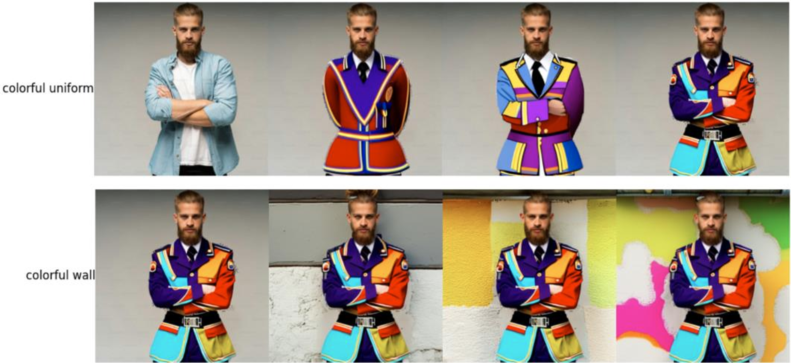
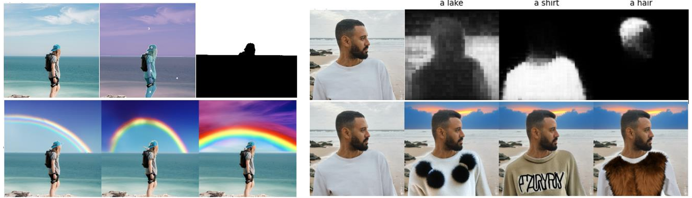

## Video Demonstration
* The video demonstration is available to view [here](https://youtu.be/rLO7bdN8jOE?si=jVWq16wLLI2A77GB).
## Introduction

    

    

The project of practice employs a hybrid technical framework combining Stable Diffusion with a segmentation
model to facilitate personalized image modifications. Users can customize specific area, such as
clothing, hats or background in images by entering specific descriptions. It supports multiple edits
on the same image, offering incremental creative joy.
The system uses a segmentation model to automatically detect key parts such as clothing and
backgrounds. It then employs the Stable Diffusion model to transform textual descriptions into
corresponding visual modifications. Users are presented with three modified images to choose
from for further edits, allowing for multiple iterations of customization.
The project is designed to empower individuals without professional artistic skills to create and
customize images using words, thereby enhancing creative expression. It integrates Stable
Diffusion and image segmentation technologies to tackle the complexities of multi-model
collaboration, which provide a practical learning experience in AI application. This also responds
to the growing market demand for quick and convenient personalization of images.

## Reference
A. CLIPSeg:  [here](https://huggingface.co/docs/transformers/model_doc/clipseg)

B.Segment-anything  [here](https://segment-anything.com/)

C. Tutorials for segmentation  [here](https://www.youtube.com/watch?v=fVeW9a6wItM)

